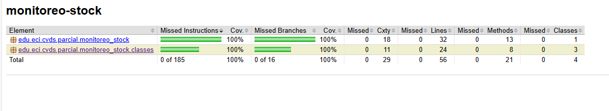

# PARCIAL PRIMER CORTE - SOLID, PATRONES, TDD, SPRING

## PRE-RREQUISITOS
- Java JDK Runtime Environment: 17.x.x
- Apache Maven: 3.9.x
- JUnit: 5.x.x

## NECESIDAD DEL CLIENTE
El cliente necesita un sistema de monitoreo de stock de productos, el cual le permita agregar productos nuevos y actualizar la cantidad de productos disponibles. Adicionalmente cada vez que un producto sea actualizado es necesario que se notifique a los dos agentes que serán implementados; Para los agentes es necesario tener en cuenta las siguientes características, el primero deberá escribir en el stdout las unidades disponibles y el segundo agente deberá escribir en el stdout si hay menos de 5 unidades disponibles lo cual generará una alerta. 
## REQUERIMIENTO
### FUNCIONALES
1. **Añadir un producto:** los productos deben tener nombre, precio, cantidad en stock y categoría.
2. **Modificar stock:** Se debe actualizar la cantidad de producto disponible y adicionalmente se debe notificar a los interesados.
    - Notificar el cambio de stock: Los agentes se deben ejecutar según los requerimientos de cada uno, cuando el stock de cualquier producto se vea afectado.
### AGENTES:
##### AGENTE LOG
Este agente debe escribir en stdout cada vez que se modifica el stock de un producto.
Ejemplo:
```bash
 Prodcto: xbox one s -> 10 unidades disponibles
 ```
##### AGENTE ADVERTENCIA
Este agente debe escribir en stdout cada vez que el stock de un producto es menor a 5.
Ejemplo:
```bash
 ALERTA!!! El stock del Prodcto: xbox one s es muy bajo, solo quedan 4 unidades.
 ```
## DESCRIPCIÓN DEL PROYECTO
Se debe crear un repositorio en GitHub el cual debe tener un proyecto maven que funcione con spring-boot, este proyecto deberá darle solución a los requerimientos del cliente y seguir los principios SOLID. Se debe implementar por lo menos un patrón de diseño, usar la inyección de dependencias para instaciar objetos y es necesario Que las pruebas de unidad reflejen el correcto funcionamiento de los agentes.

#####  ES IMPORTANTE RECORDAR QUE:

1. El almacenamiento puede ser en estructuras en memoria como Listas, Mapas, etc
2. Se debe subir el link del proyecto en el espacio de campus virtual.
3. El proyecto debe contar con el diseño documentado en el readme del repositorio y debe terner capturas de pantalla mostrando su funcionamiento.

---
## Diseño
Se decidio estructurar el diagrama de clases de la aplicacion de la siguiente manera:

Los patrones de diseño que se usaron fueron Singleton en AgentLog, AgentWarning y SystemMonitoringStock. Esto porque dentro de la aplicacion solo hay un sistema de inventarios / stock (SystemMonitoringStock) y solo hay un agente (AgentLog) que notifica del inventario y solo hay un agente (AgentWarning) que notifica cuando el inventario es bajo


## Solucion del parcial
1. Se crea la estructura del proyecto usando springboot e integrando jacoco

2. Se definen las clases para usar: producto, Agent (interface), AgentLog, AgentWarning y SystemMonitoringStock.

3. Se crean los metodos que se usaran para resolver los requerimientos y se documenta lo que se espera de ellas.

4. Se crean las pruebas unitarias de los metodos previamente creados y las pruebas fallan.


5. Se escribe el codigo minimo para que pasen correctamente las pruebas.

6. Las pruebas pasan correctamente.

7. Jacoco 85%



